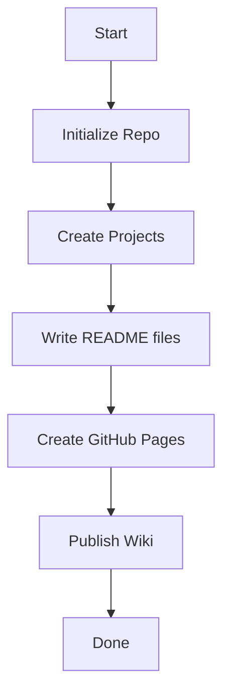

# 🌐 .NET Developer Portfolio

Welcome to my .NET developer portfolio! This file also serves as a showcase of Markdown features supported by GitHub, including diagrams, formatting, and layout tips.

---

## 📑 Table of Contents

- [About Me](README.md#-about-me)
- [Contact](README.md#-contact)
- [Project Overview](README.md#-project-overview)
- [GitHub Pages CV](README.md#-github-pages-cv)
- [C# Wiki Best Practices](README.md#-c-wiki-best-practices)
- [Markdown Showcase](README.md#-markdown-showcase)


---

## 👤 About Me


**Name**: Alexander Mitrev  
**Title**: .NET Developer  
**Location**: Bulgaria

> "I am a passionate software developer focused on building clean and maintainable .NET applications."


---

## 📫 Contact

- 📧 Email: mitrevalexander@gmail.com  
- 💼 [LinkedIn](https://www.linkedin.com/in/alexander-mitrev)  
- 💻 [GitHub](https://github.com/almit1)

---

## 🧰 Project Overview

### 📦 Project 1: Inventory App
Simple C# console app for managing inventory.
- Technologies: `.NET 6`, `C#`
- [Link to project](./Project1-InventoryApp)

### 🌐 Project 2: Web API
A minimal ASP.NET Core API.
- Technologies: `ASP.NET Core`, `C#`
- [Link to project](./Project2-WebAPI)

### 💻 Project 3: Blazor App
An interactive Blazor WebAssembly app.
- Technologies: `Blazor`, `Razor`, `WebAssembly`
- [Link to project](./Project3-BlazorApp)

### 🛠 Project 4: Console Tool
Command-line tool to perform basic tasks.
- Technologies: `C#`, `CLI`
- [Link to project](./Project4-ConsoleTool)

---

## 📄 GitHub Pages CV

My professional CV is available as a GitHub Pages site:
👉 [View CV](https://almit1.github.io/SWU_demo/)  
📁 Stored in the `docs/` folder of this repo.

---

## 📘 C# Wiki Best Practices

The repository includes a full [📘 C# Wiki](https://github.com/almit1/SWU_demo/wiki) covering:

- Naming conventions
- SOLID principles
- Clean code examples
- Common mistakes

---

## 🧪 Markdown Showcase

### Emphasis
*Italic*, **Bold**, ***Bold Italic***

### Lists

- Unordered item 1
- Unordered item 2
  - Nested item

1. Ordered item 1
2. Ordered item 2

### Code

Inline `code` example  

Code block:

```csharp
public class HelloWorld {
    public static void Main() {
        Console.WriteLine("Hello, World!");
    }
}
```

### Table

| Project        | Type     | Technology     |
|----------------|----------|----------------|
| Inventory App  | Console  | .NET 6         |
| Web API        | API      | ASP.NET Core   |
| Blazor App     | Web      | Blazor         |

### Task List

- [x] Create Portfolio Repo
- [x] Add Projects
- [x] Write README
- [ ] Publish GitHub Pages
- [ ] Write Wiki

---

### 🧠 Mermaid Diagram




---
Thanks for visiting! ⭐ Feel free to fork or star the repo.
